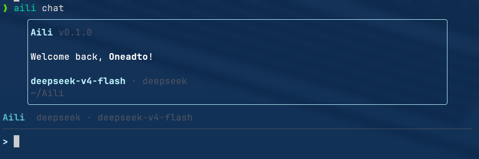

这一轮目标是：
1、把aili chat启动命令更改为aili，然后新建一个可用命令.md文件，把所有可用命令存在该文件内。
2、每次启动aili agent时，直接刷新终端窗口然后全屏渲染出欢迎页，类似于claude code、codex、deepseek-tui等coding agent的启动逻辑，退出时的退出逻辑也应该采取类似的刷新终端做法。
3、联网搜索claude code相关文档，了解一下Claude code的螃蟹logo是如何渲染到欢迎页的
4、，如图所示，输入框上方有一条Aili  deepseek ·  deepseek-v4-flash的字样，我不需要，我更需要用户完成输入后Claude code的那种拦截的做法，搜索一下那种是什么，能否做到。